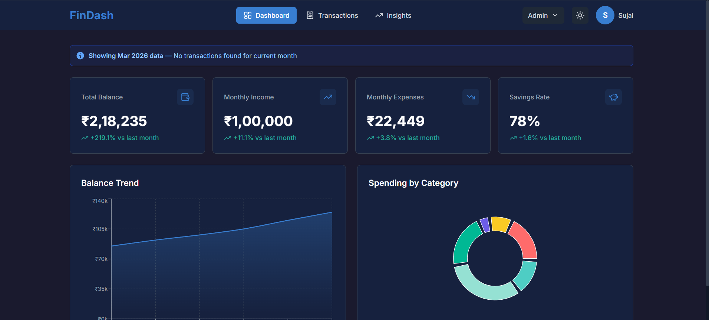

# FinDash - Finance Dashboard


A modern, feature-rich finance dashboard built for the Zorvyn FinTech internship screening assignment. This application provides comprehensive expense tracking, income management, and financial insights with a professional dark UI inspired by Zerodha Kite.

## 📸 Screenshots



## 🚀 Tech Stack

- **React** - UI library for building interactive interfaces
- **Vite** - Next-generation frontend build tool
- **Tailwind CSS** - Utility-first CSS framework
- **Recharts** - Composable charting library for React
- **Zustand** - Lightweight state management with persistence
- **Lucide React** - Beautiful open-source icon library

## ✨ Features

### Core Features

- **Dashboard Overview** - Real-time KPIs with animated counters
  - Total Balance
  - Monthly Income
  - Monthly Expenses
  - Savings Rate with percentage deltas

- **Transaction Management**
  - Add, edit, and delete transactions (Admin only)
  - Advanced filtering (search, type, sort)
  - CSV export functionality
  - Mobile-responsive table/card view

- **Financial Insights**
  - Top spending category analysis
  - Monthly expense comparison
  - Savings goal tracker with progress bar
  - Biggest transaction highlighter
  - 6-month income vs expense trends

### Interactive Charts

- **Balance Trend** - Area chart showing 6-month balance history
- **Spending by Category** - Donut chart with category breakdown
- **Monthly Comparison** - Bar chart comparing current vs last month
- **Income vs Expense** - Grouped bar chart for 6-month comparison

### Role-Based Access Control (RBAC)

- **Admin Role** - Full access to create, read, update, delete transactions
- **Viewer Role** - Read-only access to all data
- Instant role switching via navbar dropdown
- UI elements dynamically show/hide based on role

### Theme System

- **Dark Mode** (Default) - Professional dark theme inspired by Zerodha Kite
- **Light Mode** - Clean light theme alternative
- Persistent theme preference
- Smooth transitions between themes

### Data Persistence

- Local storage integration via Zustand persist middleware
- Transactions persist across browser sessions
- Theme and role preferences saved

### Responsive Design

- Mobile-first approach (375px to 1280px+)
- KPI cards stack 2x2 on mobile
- Table transforms to card list on smaller screens
- Hamburger menu for mobile navigation

### Enhanced UX

- **Smart Data Fallback** - Automatically shows most recent month's data when current month is empty
- **Month Indicator** - Clear notification when displaying fallback data
- Animated number counters on KPI cards
- **Gradient Hover Effects** - Subtle gradient overlays on KPI cards with icon animation
- **Animated Progress Bar** - Savings goal progress bar fills smoothly on page load
- **Pagination System** - Transaction table with 10 items per page and intuitive navigation
- Loading skeletons for better perceived performance
- Smooth page transitions
- Empty states with helpful messages
- Custom tooltips on all charts

## 📁 Project Structure

```
finance-dashboard/
├── src/
│   ├── components/
│   │   ├── Charts/
│   │   │   ├── BalanceTrend.jsx
│   │   │   ├── SpendingDonut.jsx
│   │   │   ├── MonthlyComparison.jsx
│   │   │   └── IncomeExpenseBar.jsx
│   │   ├── Navbar.jsx
│   │   ├── KPICard.jsx
│   │   ├── TransactionTable.jsx
│   │   ├── TransactionModal.jsx
│   │   └── InsightCard.jsx
│   ├── pages/
│   │   ├── Dashboard.jsx
│   │   ├── Transactions.jsx
│   │   └── Insights.jsx
│   ├── store/
│   │   └── useStore.js
│   ├── data/
│   │   └── mockData.js
│   ├── App.jsx
│   ├── main.jsx
│   └── index.css
├── public/
├── index.html
├── package.json
├── vite.config.js
├── tailwind.config.js
├── postcss.config.js
└── README.md
```

## 🛠️ Setup & Installation

### Prerequisites

- Node.js (v16 or higher)
- npm or yarn

### Installation Steps

1. Clone the repository:

```bash
git clone <repository-url>
cd finance-dashboard
```

2. Install dependencies:

```bash
npm install
```

3. Start the development server:

```bash
npm run dev
```

4. Open your browser and visit:

```
http://localhost:5173
```

### Build for Production

```bash
npm run build
```

Preview the production build:

```bash
npm run preview
```

## 💡 Usage Guide

### Switching Roles

1. Click on the role dropdown in the top-right corner
2. Select either **Admin** or **Viewer**
3. UI will instantly update to show/hide relevant actions

### Managing Transactions (Admin Only)

**Add Transaction:**

1. Navigate to Transactions page
2. Click "Add Transaction" button
3. Fill in the form (Date, Description, Category, Type, Amount)
4. Click "Add Transaction"

**Edit Transaction:**

1. Click the edit icon (pencil) on any transaction row
2. Modify the fields
3. Click "Update Transaction"

**Delete Transaction:**

1. Click the delete icon (trash) on any transaction row
2. Confirm deletion

### Exporting Data

1. Navigate to Transactions page
2. Apply any filters you want
3. Click "Export CSV" button
4. File downloads with current date in filename

### Filtering Transactions

- **Search** - Filter by description or category
- **Type Filter** - Show all, income only, or expense only
- **Sort** - By date or amount, ascending/descending

## 🎨 Design System

### Colors

- **Primary:** `#387ed1` (Blue - like Zerodha Buy button)
- **Success/Income:** `#26a69a` (Green)
- **Danger/Expense:** `#ef5350` (Red)
- **Dark Background:** `#1a1a2e`
- **Dark Card:** `#16213e`

### Typography

- **Font Family:** Inter (Google Fonts)
- Clean, readable sans-serif for all text

### UI Principles

- Solid color buttons (no gradients)
- Rounded cards with subtle borders
- Consistent spacing and padding
- High contrast for readability

## 🔐 RBAC Implementation

The application implements Role-Based Access Control with two roles:

| Feature            | Admin | Viewer |
| ------------------ | ----- | ------ |
| View Dashboard     | ✅    | ✅     |
| View Transactions  | ✅    | ✅     |
| View Insights      | ✅    | ✅     |
| Add Transaction    | ✅    | ❌     |
| Edit Transaction   | ✅    | ❌     |
| Delete Transaction | ✅    | ❌     |
| Export CSV         | ✅    | ✅     |
| Switch Theme       | ✅    | ✅     |

Role state is managed globally via Zustand and persisted in localStorage.

## 🚀 Deployment

### Deploy to Vercel

1. Push your code to GitHub
2. Visit [vercel.com](https://vercel.com)
3. Import your repository
4. Deploy with default settings

### Deploy to Netlify

1. Push your code to GitHub
2. Visit [netlify.com](https://netlify.com)
3. Connect your repository
4. Build command: `npm run build`
5. Publish directory: `dist`

## 🔮 Future Enhancements

- User authentication and multi-user support
- Backend API integration
- Real-time data synchronization
- Advanced analytics and forecasting
- Budget planning tools
- Recurring transactions
- Multi-currency support
- Data import from bank statements

## 👨‍💻 Developer

**Sujal**
Developed for Zorvyn FinTech Internship Screening

## 📄 License

This project is created for educational and assessment purposes.

## 🎯 Recent Improvements

### v1.1.0 - Enhanced User Experience

**1. Smart Data Fallback System**

- Automatically detects when current month has no transactions
- Falls back to most recent month's data (e.g., shows Mar 2026 when Apr 2026 is empty)
- Clear blue notification banner indicating which month's data is being displayed
- Applied to Dashboard and Insights pages

**2. Enhanced KPI Cards**

- Subtle gradient overlay (primary to success) on hover
- Icon background animates with color intensity on hover
- Improved visual feedback and modern aesthetic
- Smooth transitions for all hover states

**3. Animated Savings Goal**

- Progress bar now fills smoothly over 1 second on page load
- Enhanced visual impact with ease-out animation
- Better user engagement with the savings tracker

**4. Transaction Pagination**

- 10 transactions per page for better performance
- Smart pagination controls with Previous/Next buttons
- Page number buttons with ellipsis for long lists
- Shows current range (e.g., "Showing 1 to 10 of 25 transactions")
- Automatically resets to page 1 when filters change
- Fully responsive on mobile and desktop

**5. Bug Fixes**

- Fixed "Biggest Transaction This Month" card showing empty data
- Improved date filtering logic across all components
- Enhanced MonthlyComparison chart to use fallback data correctly

---

**Live Demo:** https://financedashboard264.netlify.app/

**Repository:** [Add your GitHub repo link here]
